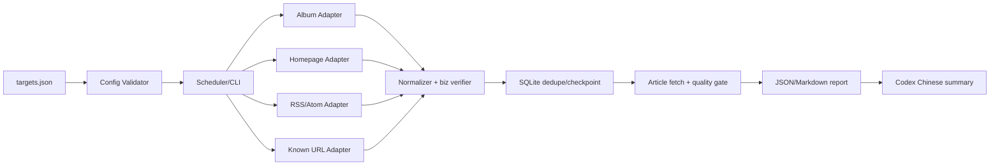

# 架构开发文档：pola-wechat-public-account-reader

artifact: architecture-plan

## 1. 背景和目标

微信公众号没有可枚举任意第三方账号的官方开放 API；免费公开入口具有栏目化和反爬限制。本方案在这些约束下提供可运行、可扩展且不会误报的情报监控 Skill。

## 2. 当前系统理解

目标仓库是松散 Skill 集合，没有统一 runtime 或测试框架。Codex 通过 `SKILL.md` 发现 Skill；复杂、重复和高风险动作应封装为脚本。仓库已有大量与本任务无关的未提交文件，本次仅新增独立目录和交付文档。

## 3. 项目 Arch Reference 摘要

- arch-reference 路径：`docs/pola/arch-reference.md`
- 本次事实：
  - Skill 必须自包含。
  - Python 标准库是最低依赖方案。
  - 运行状态不能写入 Skill 安装目录。
- 必须复用：
  - Codex `SKILL.md` + `agents/openai.yaml`。
  - Pola 需求、架构、测试、回归和开发日志门禁。
- 不可破坏：
  - 不使用本机微信和登录态。
  - 不把来源失败或不完整零结果写成确定“无更新”。

## 4. 架构选型分析

| 候选方案 | 一致性 | 免费程度 | 完整性 | 风险 | 验证/回滚 | 结论 |
| --- | --- | --- | --- | --- | --- | --- |
| A 单一微信网页爬虫 | 中 | 高 | 低 | CAPTCHA、schema 变化、误报 | 难 | 拒绝 |
| B 免费多源 adapter + 状态机 | 高 | 高 | 中低但可观测 | 可控 | 易 | 推荐 MVP |
| C 商业 API 单源 | 中 | 低 | 供应商声称较高 | 黑盒、SLA、合规 | 中 | 可选 provider，不作默认 |
| D 微信客户端/账号池 | 低 | 表面免费 | 可能较高 | 登录、风控、合规 | 难 | 明确拒绝 |

### 架构选型结论

推荐候选 B：以免费多源 adapter 为核心，保留远程 provider 扩展点。

拒绝方案：

- A：不能区分“没有更新”和“页面被阻断”。
- C：未经 POC 不能成为唯一生产来源。
- D：违反用户的纯公网约束。

决策约束：

- 只使用公开 URL 和用户显式配置的远程 API。
- 默认无第三方 Python 依赖。
- 所有来源统一返回结构化 observation，不直接决定“无更新”。
- 文章内容必须通过 WeChat 异常页质量门禁。

## 5. 方案概览



## 6. 模块影响

| 模块 | 改动 | 原因 | 风险 |
| --- | --- | --- | --- |
| Skill instruction | 新增工作流和门禁 | 让 Agent 正确选源、解释覆盖 | 指令过长 |
| Config/model | 新增 JSON schema 语义 | 稳定目标身份和 source 配置 | 用户配置错误 |
| Public adapters | Album/Homepage/RSS/URL | 免费公网发现 | 上游变化 |
| Storage | SQLite | 去重、运行证据、幂等 | 写入失败 |
| Content gate | HTML 元数据和异常页检测 | 防止 CAPTCHA 伪正文 | 假阳/假阴 |
| Report | JSON + Markdown | 供 cron、人和 LLM 消费 | 摘要输入过长 |
| Harness | fixtures + live smoke | 可重复验证 | 公网测试波动 |

## 7. 数据流和接口

### CLI

```text
python3 scripts/wechat_monitor.py validate --config targets.json
python3 scripts/wechat_monitor.py run --config targets.json --state state.sqlite --output output
python3 scripts/wechat_monitor.py cron --config ... --state ... --output ...
python3 scripts/run_harness.py
```

### Target

```json
{
  "id": "instachina",
  "name": "InsDaily",
  "wxid": "instachina",
  "biz": "MzI2MTcxMjI0MQ==",
  "priority": "normal",
  "sources": [
    {"type": "wechat_album", "album_id": "PUBLIC_ALBUM_ID"},
    {"type": "wechat_homepage", "hid": "PUBLIC_HID"},
    {"type": "rss", "url": "https://publisher.example/feed.xml"}
  ]
}
```

### Observation

```json
{
  "target_id": "instachina",
  "source_type": "wechat_album",
  "status": "ok",
  "coverage": "partial",
  "articles": [],
  "error_code": null,
  "observed_at": "ISO-8601"
}
```

### Article 唯一键

依次使用：

1. `biz + mid + idx + sn`
2. canonicalized URL
3. `biz + published_at + title`

SQLite 主键和运行期合并键使用 `(target_id, article_key)`，避免同一 URL 被不同监控目标引用时互相吞掉告警。

## 8. 性能和安全护栏

- 单次请求超时默认 15 秒。
- 单次运行总 deadline 默认 600 秒；每次请求、重试退避、分页和正文抓取均检查剩余时间。
- 最大响应 5 MiB，文章正文最大保留 200 KiB 文本。
- 默认串行请求；不超过每来源 1 个并发。
- 默认最多 100 个目标、每目标 10 个来源、单次 5,000 个归一化候选。
- 配置必须是最大 1 MiB 的普通文件；CLI 首次读取由固定 10 秒进程 deadline 保护，成功后把已校验对象传给 runner，避免二次读取。
- cron 示例使用 `mkdir` 原子锁或系统 `flock`，单次运行外层超时 10 分钟。
- 网络/429/5xx 只做有限退避；blocked/schema 错误不盲目重试。
- 每次实时检查回看 72 小时，夜间回补 7 天。
- SQLite 事务在报告成功写入前不提交新文章通知状态。
- SQLite `runs` 和 `source_observations` 与报告使用同一保留天数清理；文章唯一键和 checkpoint 长期保留以维持去重。
- 配置禁止明文 secret；provider key 只能引用环境变量名。
- HTTPS transport 禁用环境代理，DNS 解析后固定连接到已验证的公网地址；重定向逐跳重验，含 provider secret 的请求禁止跨 origin 重定向。
- env header 仅接受有界可打印 ASCII；非法值使用固定错误码，不把值带入报告或 SQLite。
- cron 渲染拒绝 CR/LF/NUL 和 crontab 特殊字符 `%`。
- 不记录 Cookie、Token、完整正文或请求头。

## 9. 文件改动计划

| 文件 | 操作 | 内容 | 验收 |
| --- | --- | --- | --- |
| `pola-wechat-public-account-reader/SKILL.md` | 新增 | Agent 工作流与状态门禁 | A2/A5/A8 |
| `agents/openai.yaml` | 新增 | Codex UI 元数据 | A2 |
| `scripts/wechat_monitor.py` | 新增 | CLI | A3–A7/A11 |
| `scripts/pola_wechat_reader/*.py` | 新增 | 配置、适配器、状态、报告 | A3–A8 |
| `scripts/run_harness.py` | 新增 | 一键 harness | A9/A10 |
| `tests/*` | 新增 | fixtures 与单元/集成测试 | A9 |
| `assets/targets.example.json` | 新增 | 安全示例 | A4/A11 |
| `references/*.md` | 新增 | 来源边界、配置、运维 | A3/A5/A11 |
| `docs/pola/**` | 新增 | 交付证据 | A1 |

## 10. 测试策略

| 测试类型 | 方式 | 覆盖 |
| --- | --- | --- |
| 静态 | `quick_validate.py`、`compileall` | A2 |
| 单元 | `unittest` + fixtures | A3–A7 |
| 集成 | 临时 SQLite 运行两次 | A5/A6/A8 |
| 联网 | 无登录公开 Album/Homepage/RSS smoke | A10 |
| 安全 | 跨域 secret、DNS 固定连接、deadline、容量边界、secret/个人路径扫描 | A1/A11/A13 |

## 11. 部署和回滚

- 安装：在 `~/.codex/skills/` 创建指向源码目录的符号链接。
- 不自动安装 cron，不修改生产服务，不发送真实通知。
- 回滚：删除该符号链接；源码和运行状态保持不变。
- 若用户后续启用 cron，应先 dry-run、指定独立工作目录并设置日志轮转。

## 12. 验收映射

- A1：项目文档 + devlog。
- A2：Codex quick validator。
- A3/A4/A7：adapter/config/content 单测。
- A5/A6：两次运行的 SQLite 集成测试。
- A8：报告 schema 与 Skill 摘要步骤。
- A9：`run_harness.py`。
- A10：live smoke 输出证据。
- A11：cron 命令生成器和文档。
- A12：安装链接及安装后 quick validator。
- A13：HTTP transport、跨目标去重、摘要污染和数据库清理回归测试。

## 13. 未决问题

- `instachina` 当前没有已确认的 Album ID 或 Homepage HID；仅有 `biz` 不能通过免费官方网页稳定枚举完整历史。
- 生产级完整性需要 14–30 天 POC 比较远程 provider 和公开校验源。
