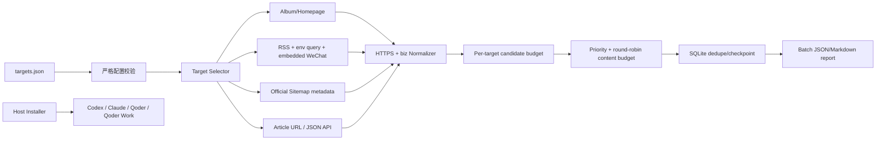

# 架构开发文档：pola-wechat-public-account-reader V2

artifact: architecture-plan

## 1. 背景和目标

V1 已具备多 target 数据模型、五类 adapter、SQLite、报告和 38 项离线测试，但批量控制、公平正文预算、机器之心案例和跨宿主安装尚未成为正式产品能力。V2 在不重写 runtime、不破坏旧配置和状态的前提下补齐这些能力。

## 2. 当前系统理解

- Python 标准库 Skill，无统一仓库级构建系统。
- `run_monitor` 顺序遍历 target/source。
- 报告已逐目标聚合，但顶层无批量选择元数据。
- 正文预算按文章顺序消耗，前置 target 可能占满。
- 普通 RSS 保留 feed item URL，不识别 description 内微信原文。
- `json_api` 不分页。
- Codex 安装链接仍指向已不存在的旧源码路径。

## 3. 项目 Arch Reference 摘要

- arch-reference：`docs/pola/arch-reference.md`
- 复用：
  - `targets[]`、SourceFetcher、Article、SourceObservation。
  - SQLite `(target_id, article_key)` 去重。
  - `SKILL.md`、`agents/openai.yaml` 和现有 harness。
- 不可破坏：
  - 纯公网、不使用微信登录态。
  - 免费/部分来源不得输出 complete。
  - 状态、报告和凭据不写入 Skill 安装目录。
  - 旧 `version=1` 配置和 SQLite 可继续使用。

## 4. 架构选型分析

| 候选 | 一致性 | 复用 | 批量 | 合规 | 验证/回滚 | 结论 |
| --- | --- | --- | --- | --- | --- | --- |
| A 只补文档，沿用现有 runtime | 高 | 高 | 弱 | 中 | 易 | 拒绝，无法解决公平性和机器之心能力 |
| B 扩展现有 adapter/runner/CLI | 高 | 高 | 强 | 强 | 易 | 推荐 |
| C 单独开发机器之心爬虫和四份宿主副本 | 低 | 低 | 中 | 风险高 | 难 | 拒绝 |
| D 接入禁止自动访问的第三方镜像作为默认源 | 中 | 中 | 强 | 不可接受 | 难 | 拒绝 |

### 架构选型结论

推荐 B：保持单 runtime，增加通用 RSS 原文提取、官方 sitemap、批量选择、公平预算和宿主安装器。

拒绝方案：

- C 会产生四份代码漂移和 provider 专用耦合。
- D 与公开服务条款冲突，不能作为定时监控默认源。

决策约束：

- V2 默认仍串行；先保证公平、幂等和确定性，再评估并发。
- 机器之心免费默认只启用官方 sitemap；官方 RSS 仅在订阅或书面许可支持 Agent 接入时启用；受限镜像只允许权限门禁后的可选配置。
- 宿主安装默认 read-only check，实际安装必须显式执行。
- 不做 SQLite 破坏性迁移。

## 5. 方案概览



## 6. 模块影响

| 模块 | 改动 | 风险 |
| --- | --- | --- |
| `config.py` | 严格布尔、重复 source、批量预算、RSS query/授权、sitemap schema | 旧宽松配置可能被正确拒绝 |
| `parsers.py` | 嵌入微信链接、sitemap gzip/XML 解析 | 上游 schema 差异 |
| `sources.py` | target-aware RSS、env query、sitemap adapter | token 泄漏、解压炸弹 |
| `runner.py` | target 过滤、候选 HTTPS、公平正文预算 | 顺序和幂等回归 |
| `models.py` | 来源/原文追溯字段 | 报告 schema 扩展 |
| `reporting.py` | 批量计数、混合失败语义、Markdown 转义 | 消费者兼容 |
| `wechat_monitor.py` | target/priority filters | cron 渲染兼容 |
| `install_hosts.py` | 四宿主检查和显式安装 | 覆盖现有安装 |
| fixtures/tests | 批量、机器之心、secret、宿主安装 | 测试成本 |

## 7. 数据流和接口

### 7.1 新增 defaults

```json
{
  "max_candidates_per_target": 1000,
  "max_content_fetches_per_target": 3,
  "max_sitemap_uncompressed_bytes": 10485760
}
```

### 7.2 RSS 环境变量 query

```json
{
  "type": "rss",
  "url": "https://publisher.example/rss",
  "query_from_env": {
    "token": "PUBLISHER_RSS_TOKEN"
  }
}
```

请求 URL 只在内存中构造；配置、source key、报告和错误中不包含环境变量值。

### 7.3 授权 RSS 嵌入微信原文

```json
{
  "type": "rss",
  "url": "https://authorized.example/account.rss",
  "entry_link_mode": "wechat_original_from_description",
  "expected_author": "机器之心",
  "permission_reference": "internal-approval-id",
  "permission_required": true
}
```

### 7.4 sitemap

```json
{
  "type": "sitemap",
  "url": "https://publisher.example/sitemap.xml.gz",
  "nested_https_url": true,
  "url_pattern": "^https://publisher\\.example/articles/",
  "published_at_from_url": "/articles/(\\d{4}-\\d{2}-\\d{2})"
}
```

### 7.5 批量选择

```text
run --target machineheart --target another
run --exclude-target low-value --priority critical --priority normal
```

选择顺序保持配置顺序；过滤只缩小 enabled target 集合。

## 8. 关键实现决策

### 8.1 公平正文预算

先按 priority 排序，再对同优先级 target 轮询：

1. 每个 target 最多 `max_content_fetches_per_target`。
2. 全局最多 `max_content_fetches`。
3. 未分配正文预算的文章仍保留来源摘要。

### 8.2 嵌入微信原文

- 使用 `HTMLParser`，只接受一个明确的微信文章链接。
- host 必须精确等于 `mp.weixin.qq.com`。
- 与 target `biz` 不一致时拒绝该 item。
- feed item link 保存为 `source_url`；微信链接为 `url/original_url`。
- 摘要只取短 intro，不保存转载全文。

### 8.3 sitemap

- 仅接受 gzip 或 XML。
- 解压累计字节达到上限立即失败。
- 修复双前缀时只提取 loc 中的内层 HTTPS URL。
- URL 必须匹配配置正则并再次通过公网 HTTPS 校验。
- 日期只从显式 regex 提取；`lastmod` 不默认视为发布时间。
- 解析时只保留有界数量的最新候选，不把整个 sitemap 物化为无界文章列表。
- 机器之心 sitemap 默认 `fetch_content=false`；文章 URL 返回数据服务引导页时明确阻断，不伪装成正文。

### 8.4 宿主兼容

- 核心保持 Agent Skills 规范，只维护一份 `SKILL.md`。
- Codex 可保留 `agents/openai.yaml`。
- 安装器映射：
  - Codex：`$CODEX_HOME/skills` 或 `~/.codex/skills`
  - Claude Code：`~/.claude/skills`
  - Qoder：`~/.qoder/skills`
  - Qoder Work：`~/.qoderwork/skills`
- 默认检查，不覆盖真实目录或有效不同链接。
- 只允许显式 repair 已确认的断链。

### 8.5 失败真实性与 URL 安全

- RSS/Atom、sitemap 和 JSON API 都先校验根结构或配置路径；维护页、字段改名、空 URL 和被拒绝的
  嵌入原文不能降格成 `observed_zero`，而是形成带拒绝计数的 `source_unavailable`。
- 候选 URL 在规范化前检查 credentials 和敏感 query，避免 userinfo 或 `token` 被 canonicalization
  擦除后进入状态；公网 IPv6 literal 在 canonical URL 中保留方括号。
- 只有 `mp.weixin.qq.com` URL 可提供 `__biz/mid/idx/sn` 身份并生成 `wx:` 去重键；其它域名即使
  伪造同名 query 也只能按来源绑定和 canonical URL hash 处理。
- HTTP 失败只抛出新建的脱敏 `SourceError`，不保留带 query secret 的 `HTTPError` cause/context。
- Markdown 报告对 URL 的 netloc、path 和 query 做百分号编码，防止 `>` 等分隔符闭合 angle link。

## 9. 测试策略

| 类型 | 覆盖 |
| --- | --- |
| 配置单测 | 严格 bool、重复 source、授权引用、query env、sitemap |
| parser 单测 | 嵌入微信、错误 biz、多链接、gzip sitemap |
| runtime 集成 | 3 target 局部失败、公平预算、二次去重、结果语义 |
| CLI 单测 | ID/排除/priority 过滤和未知目标 |
| 安全单测 | 非 HTTPS 候选、query secret 脱敏、解压上限、Markdown 转义 |
| 宿主测试 | 临时 HOME 下四目录 check/install；从安装路径运行 harness |
| live smoke | Album/Homepage + 机器之心官方 sitemap；官方 RSS 仅在有 Agent 接入权益且显式 Token 存在时 |

## 10. 部署和回滚

- 源码目录保持为 `PolaSkills/pola-wechat-public-account-reader`。
- 修复 Codex 断链后，从安装路径运行 quick validator 和 harness。
- 不安装 Claude/Qoder/Qoder Work，除非用户另行明确要求；只验证兼容打包和临时目录安装。
- 回滚：恢复旧源码或删除新宿主链接；状态库无需回滚。
- 不创建生产 cron，不重启服务。

## 11. 验收映射

| 验收 | 实现 | 验证 |
| --- | --- | --- |
| V2-A2/A3 | config + CLI selector | config/CLI tests |
| V2-A4 | runner fair scheduler | multi-target runtime test |
| V2-A5/A6 | RSS env + embedded parser + sitemap | fixture + live sitemap |
| V2-A7 | URL/secret/permission gates | security tests |
| V2-A8 | report result semantics | report regression |
| V2-A9 | install_hosts.py | temp HOME + Codex real path |
| V2-A10 | references/capabilities-and-examples.md | docs link checker |
| V2-A11/A12 | full harness | offline/live/validators |

## 12. 未决问题

- 机器之心免费 RSS 权益不支持 AI Agent；当前没有支持 Agent 的订阅/授权与 Token，因此只验证安全注入和禁用状态，不能执行真实 RSS smoke。
- xInfinite 未提供自动访问授权证据，V2 不把它加入 live harness 或默认定时配置。
