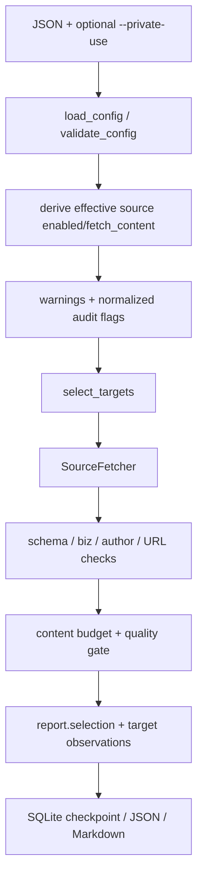

# SDD：pola-wechat-public-account-reader V3 私人宽松模式

artifact: architecture-plan

## 1. 背景和目标

V2 已具备批量目标、RSS/sitemap、权限引用、正文质量、安全和四宿主兼容。V3 需要将“来源许可策略”
与“技术安全/内容真实性”分离，让个人用户显式放开前者，而不降低后者。

## 2. 项目 Arch Reference 摘要

- arch-reference：[`docs/pola/arch-reference.md`](../../arch-reference.md)
- 项目是标准库 Python Skill；入口为 `SKILL.md` 和 `scripts/wechat_monitor.py`。
- 所有来源统一经过 `config → SourceFetcher → normalize → report/checkpoint`。
- 配置和 SQLite 保持 `version=1`；报告扩展采用 additive 字段。
- 不可破坏：公网 HTTPS/SSRF、secret、deadline/容量、身份、正文质量、锁、去重和失败真实性。

## 3. 架构选型

| 候选 | 一致性 | 兼容 | 可审计 | 风险 | 结论 |
| --- | --- | --- | --- | --- | --- |
| A 删除 permission 门禁并全开 disabled | 低 | 低 | 低 | 会误启运维暂停源 | 拒绝 |
| B 双策略 + 来源显式私人标记 | 高 | 高 | 高 | 增加少量字段 | 采用 |
| C 单独维护私人版 runtime | 低 | 中 | 中 | 代码分叉和测试重复 | 拒绝 |

决策：扩展现有配置和 CLI，使用 `enforced/private_opt_in` 双策略。

决策约束：

- 私人模式只启用 `enable_in_private_mode=true` 的 source，不启用停用 target。
- `permission_required` 不删除；override 进入 warning 和报告。
- 官方 RSS 的环境 Token 仍必需；不得回退到 Cookie、inline secret 或鉴权绕过。
- `publisher_data_service_gate`、CAPTCHA 和登录页继续视为非正文。

## 4. 数据模型

`defaults`：

```json
{
  "source_permission_policy": "enforced"
}
```

source 输入字段：

```json
{
  "enabled": false,
  "enable_in_private_mode": false,
  "fetch_content": false,
  "fetch_content_in_private_mode": false,
  "permission_required": false,
  "permission_reference": "",
  "max_future_hours": 24
}
```

归一化审计字段：

- `configured_enabled`
- `enabled_by_private_mode`
- `fetch_content_by_private_mode`
- `permission_override_active`

策略优先级：CLI `--private-use` 为 `true` 时覆盖配置为 `private_opt_in`；否则使用配置，缺省
`enforced`。非法枚举联网前失败。

## 5. 数据流



## 6. 模块影响

| 文件 | 改动 | 风险 |
| --- | --- | --- |
| `config.py` | 策略枚举、私人来源/正文有效状态和 warning | 配置兼容 |
| `wechat_monitor.py` | 三命令 `--private-use`、validate 输出、cron 透传 | CLI 回归 |
| `runner.py` | selection 增加策略和 override 证据 | 报告 additive |
| `reporting.py` | Markdown 显示策略和私人放开数 | 渲染回归 |
| `run_harness.py` | 可选私人公网 smoke | 外部退化 |
| `assets/` | 私人机器之心和批量示例 | 访问面增大 |
| `tests/` | 配置、runtime、cron、安全和资产测试 | 无 |

## 7. 机器之心私人配置

- sitemap：有效启用；私人模式允许 `fetch_content=true`，仍受每目标/全局正文预算。
- 官方 RSS：有效启用；Token 从 `MACHINEHEART_RSS_TOKEN` 注入，缺失为 `missing_secret`。
- xInfinite：有效启用；`entry_link_mode=wechat_original_from_description`、作者为“机器之心”，
  `biz=MzA3MzI4MjgzMw==`，并用一小时未来时间容差过滤第三方 feed 时钟异常。
- 三者 completeness 保持 `partial`；官方 RSS 与 sitemap 仍在同一 independence group。

## 8. 安全与稳定性

私人模式不影响：

- 公网 HTTPS、DNS pin、私网/localhost、URL credentials 和敏感 inline query 拒绝。
- env secret 脱敏、Cookie 拒绝、跨 origin 鉴权重定向阻断。
- timeout、retry、run deadline、响应、gzip、分页、候选、正文和保留期上限。
- XML DTD/ENTITY、feed/sitemap schema、微信 `biz`/作者/唯一原文校验。
- 运行锁、事务、SQLite 去重和 Markdown 转义。

## 9. 测试策略

| 层级 | 内容 | 对应验收 |
| --- | --- | --- |
| unit | 策略枚举、严格布尔、effective enabled/fetch、warning | A2–A5 |
| integration | Token 缺失隔离、三来源资产、报告 selection、cron | A6–A10 |
| security | SSRF、inline secret、Cookie、内容门禁和预算 | A8、A11 |
| regression | V2 harness、SQLite、四宿主安装器语义、Codex 实机安装路径 | A12 |
| live | 默认公网 smoke；显式私人 xInfinite/RSS smoke | A6、A7、A8 |

## 10. 部署和回滚

- 无服务部署、数据库迁移、生产重启或自动 cron。
- Codex 通过现有符号链接立即读取规范源码。
- 回滚：移除 `--private-use` 或将配置策略设回 `enforced`；删除私人资产不会影响 SQLite。
- 若公网来源退化，保留报告证据并停用对应 source，不修改其它目标状态。

## 11. 验收映射

- A1：V3 工程记录。
- A2–A5：`config.py` 和配置单测。
- A6–A8：私人资产、RSS runtime 和内容门禁。
- A9–A10：`runner.py`、`reporting.py`、CLI/cron。
- A11：安全测试和全量 harness。
- A12：旧入口、状态、四宿主安装器和 Codex 实机安装态回归；其余宿主 runtime smoke 不宣称完成。
