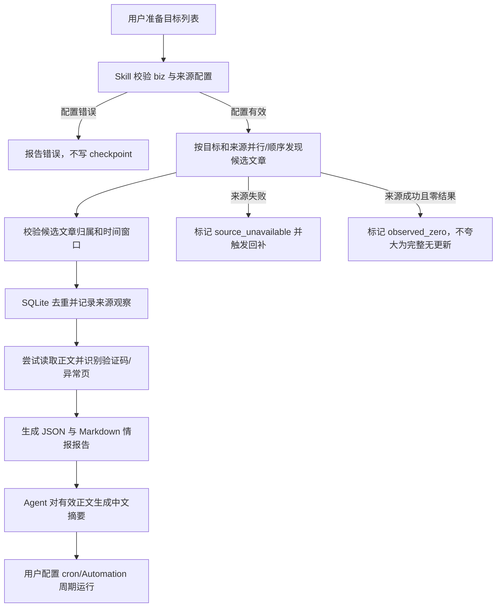

# 需求：pola-wechat-public-account-reader

artifact: requirement

## 原始需求

实现 `pola-wechat-public-account-reader` Skill：

- 通过服务器公网链接或远程 API 读取微信公众号和其它媒体内容。
- 维护目标公众号列表，通过定时任务检查是否发布新文章。
- 获取文章正文或可验证的正文信息，形成中文 summary 摘要和情报监控报告。
- 免费方案优先。
- 不依赖本机微信 App、本机微信内容、扫码登录或微信客户端内部接口。
- 完成后验证可用，并放入用户指定的 `skills` 仓库根目录，安装到 Codex。
- 提供可执行 harness。

## 需求口径

- **类型**：文档/Skill + 公网数据任务，风险等级 P2。
- **目标用户**：需要监控公众号及媒体更新的研究、内容和情报人员。
- **触发场景**：
  - 添加或检查一批微信公众号。
  - 查询某公众号近一周的新文章。
  - 生成适合 cron/Automation 的监控配置与命令。
  - 对新文章生成摘要、标签和来源健康报告。
- **输入**：
  - 目标列表；每个目标至少有内部 `id`，微信公众号建议包含 `biz`。
  - 一个或多个公网来源绑定：Album、Homepage、RSS/Atom 或已知文章 URL。
  - 时间窗口、状态库路径、报告目录和可选远程 provider 配置。
- **输出**：
  - 新文章记录、原文链接、发布时间、来源、公众号归属校验结果。
  - 可追溯的摘录式摘要输入及供 Agent 生成的中文摘要。
  - `coverage`、`source_status`、错误和回补信息。
  - JSON/Markdown 报告、SQLite 去重/checkpoint 状态。
- **非目标**：
  - 绕过验证码、登录、频率限制或微信风控。
  - 使用本机微信数据库、客户端内存、Cookie 或扫码会话。
  - 承诺仅靠免费公网源完整覆盖任意第三方公众号。
  - 未经确认直接部署生产 cron、发送外部消息或购买商业接口。
- **假设**：
  - 目标运营方或公开索引能提供至少一个可访问的 Album/Homepage/RSS/文章种子。
  - Python 3.10+ 可用。
  - 高召回生产环境可以按需增加合规的远程 provider。

## 完整用户使用流程

## 功能界面布局

本需求没有图形界面，交互面为 CLI 和文件产物：

- `config validate`：显示目标数、来源数、错误和警告。
- `run`：显示运行 ID、来源状态、新文章数、报告路径和退出码。
- JSON 报告：
  - 顶部为运行元数据与整体 coverage。
  - 中部为目标及来源状态。
  - 下部为新增文章、正文质量和错误列表。
- Markdown 报告：
  - 第一屏显示监控时间、总体状态、盲区和新文章数。
  - 新文章按公众号分组，包含标题、时间、来源、原文链接、摘要输入。
  - 来源故障与未知覆盖单独展示，避免被忽略。
- 空态：成功检查但没有候选时显示 `observed_zero`。
- 错误态：来源失败、验证码、schema 变化分别显示，不写成“没有更新”。

## 功能关系和重复性检查

- `pola-wechat-record-export` 读取本机微信聊天数据库，明确不复用。
- `ai-watchlog` 有 RSS 扫描思路，但没有持久化去重、来源健康和公众号归属验证；本 Skill 复用“报告式输出”理念，不复用其静态源清单。
- PolaNews 可作为未来摘要和通知消费者；本次 Skill 保持独立，不修改 PolaNews。
- Agent Pulse 的 source lifecycle/circuit-breaker 思路用于状态语义，但不复制其代码。
- 结论：新 Skill 与现有能力并列，职责是“公众号/媒体公网发现与读取”，不新增微信客户端路径。

## 验收标准

- **A1 文档**：需求、PRD、架构、测试证据和开发日志与实际实现一致。
- **A2 Skill 结构**：`SKILL.md` 和 `agents/openai.yaml` 通过 Codex `quick_validate.py`。
- **A3 免费公网源**：支持微信 Album、微信 Homepage、RSS/Atom 和已知文章 URL，均不读取本机微信或登录凭证。
- **A4 配置与身份**：目标配置支持 `wxid/name/biz`，候选文章可校验 `__biz`；错误目标在联网前失败。
- **A5 状态语义**：区分 `new_articles`、`observed_zero`、`partial`、`source_unavailable` 和 `unknown`。
- **A6 去重与回补**：SQLite 保留文章唯一键和运行状态；重复运行不重复报告同一篇文章。
- **A7 正文质量**：验证码、环境异常、登录页和明显非正文响应不得进入摘要。
- **A8 摘要产物**：独立脚本生成标注依据的摘录摘要，报告保留可追溯正文摘录；Agent 深化中文摘要时保留事实、链接和不确定性。
- **A9 Harness**：离线 harness 覆盖配置、三类列表源、身份、去重、异常页和状态语义；退出码为 0。
- **A10 联网验证**：至少完成一个无需登录的公网来源 smoke test；若上游阻断，结果必须准确标记来源不可用。
- **A11 定时任务**：生成安全的 cron 示例，包含锁、超时、回看窗口和绝对路径，但不自动安装生产任务。
- **A12 安装**：Skill 源码位于用户指定目录，并能从 Codex skills 目录发现。
- **A13 安全与容量**：公网请求必须把 DNS 校验结果固定到实际连接；provider secret 不跨域、不进入错误记录；配置读取、单次运行、目标数、来源数、候选数和数据库运行历史都有上限；cron 路径安全；相同 URL 在不同目标下独立去重。

## 风险

- 微信公开接口可能随时变更或按出口 IP 返回验证码。
- Album/Homepage 可能只包含栏目子集，免费源无法证明完整覆盖。
- RSSHub 或搜索引擎包装同一上游时不构成独立来源。
- 远程商业 provider 的数据来源、完整性、价格、SLA 和合规性需要单独评估。
- 定时任务若没有锁、超时、回看窗口和容量限制，可能产生重复请求或无界日志。
- 自定义 provider 若把鉴权请求跨域重定向，通用 HTTP 客户端可能泄漏 header；DNS 校验和实际连接分离也会留下重绑定窗口。

## 任务拆解

- T1：建立 Skill 结构和文档，对应 A1/A2。
- T2：实现配置、模型和稳定身份，对应 A3/A4。
- T3：实现 Album/Homepage/RSS/文章适配器，对应 A3/A7。
- T4：实现 SQLite 去重、状态和报告，对应 A5/A6/A8。
- T5：实现 harness 与联网 smoke test，对应 A9/A10。
- T6：补定时运行参考和安装，对应 A11/A12。
- T7：补跨域凭据、DNS 固定连接、全局 deadline、跨目标去重和数据库留存回归，对应 A13。
