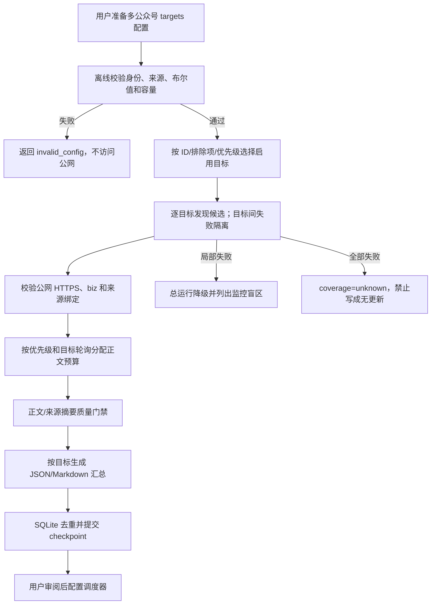

# 需求：pola-wechat-public-account-reader V2

artifact: requirement

## 原始需求

升级 `pola-wechat-public-account-reader`：

1. 批量读取、监控多个微信公众号列表。
2. 固化“机器之心”案例的公网监控、内容获取和摘要能力。
3. 兼容 Codex、Claude Code、Qoder 和 Qoder Work。
4. 在 Skill 内补充能力、使用方式和案例说明。
5. 完成测试、harness、Codex 升级，并将规范源码保存在 `PolaSkills`。

## 需求口径

- **类型**：Skill/runtime 升级 + 公网数据任务。
- **风险等级**：P2；涉及批量公网抓取、定时任务、外部来源、SQLite 和报告。
- **目标用户**：需要持续监控多个公众号或媒体源的研究、内容和情报人员。
- **输入**：
  - 包含多个 `targets[]` 的 JSON 配置。
  - 可选目标 ID、排除目标和优先级过滤。
  - 每个目标的稳定身份、公开来源、时间窗口和运行预算。
  - 可选环境变量中的、已取得 Agent 接入权益的官方 RSS Token。
- **输出**：
  - 逐目标候选、新文章、来源健康、正文和摘要状态。
  - 批量运行汇总、失败目标分布和覆盖边界。
  - JSON/Markdown 报告及 SQLite 去重状态。
  - 可按四种 Agent 宿主官方用户目录检查/安装的同一份 Skill；Codex 实机验证，其它宿主安装后需各自 smoke。
- **非目标**：
  - 绕过微信验证码、登录、Cookie、客户端或站点条款。
  - 把第三方转载站包装成官方、独立或完整来源。
  - 未获站方授权时自动轮询明确禁止自动访问的站点。
  - 自动安装生产 cron、发送通知、购买 API 或修改四个宿主的全局设置。
- **假设**：
  - Python 3.10+ 和公网 HTTPS 可用。
  - 机器之心官方 RSS 只有在相应订阅或书面许可支持 Agent 接入时才能用于本 Skill；免费 RSS 权益不支持 AI Agent。
  - 四个宿主都能消费 Agent Skills 规范的 `SKILL.md`；宿主专属元数据保持可选。

## 完整用户使用流程

## 功能界面布局

本需求没有图形界面，入口为 CLI 和文件：

- `validate`：展示启用/停用目标、来源数量、警告和批量配置错误。
- `run`：
  - 无过滤时运行所有启用目标。
  - 可重复传入 `--target`、`--exclude-target` 和 `--priority`。
  - 输出选中目标数、更新目标数、失败目标数和报告路径。
- Markdown 报告：
  - 第一屏显示整体状态、选中目标、更新目标、失败目标和 coverage。
  - 逐目标显示候选、新增和来源健康。
  - 文章同时保留原文 URL 与发现/正文来源 URL。
- 空态：仅在所有选中目标来源健康且无候选时显示 `observed_zero`。
- 混合态：任一目标未知或失败时显示 `coverage_incomplete`，不显示确定“无更新”。

## 功能关系和重复性检查

- 复用现有 `targets[]`、SourceFetcher、SQLite、报告和 harness，不新建平行 runtime。
- 扩展现有 `rss` adapter，不复制机器之心专用爬虫。
- 机器之心免费默认路径使用发布方官方 sitemap 做部分覆盖的元数据发现；取得 Agent 接入权益后才启用官方 RSS。
- xInfinite RSS/JSON 同属同一上游，且条款限制自动访问；默认不启用，也不计为独立双源。
- 四个宿主共享一份源码；安装目录只做符号链接或受控同步，不维护四份实现。
- `agents/openai.yaml` 继续只服务 Codex，其它宿主忽略该可选文件。

## 验收标准

- **V2-A1 文档**：V2 Requirement、PRD、SDD、测试用例、测试报告和 devlog 与实现一致。
- **V2-A2 批量配置**：支持至少 3 个不同目标的一次运行；严格拒绝字符串布尔值、重复 target/source key 和超限配置。
- **V2-A3 批量控制**：CLI 支持精确目标、排除目标和优先级过滤；过滤不得重新启用 disabled 目标。
- **V2-A4 失败隔离与公平性**：一个目标失败不取消其它目标；正文预算按优先级和目标轮询，前置目标不能饿死后续关键目标。
- **V2-A5 机器之心**：内置 `almosthuman2014` / `MzA3MzI4MjgzMw==` 示例；官方 sitemap 可做部分覆盖的元数据审计；在有 Agent 接入权益时支持环境变量注入官方 RSS query、来源摘要和正文质量状态。
- **V2-A6 嵌入原文**：授权 RSS 可从 description 中提取唯一微信原文 URL、标题、作者和短摘要，并验证目标 `biz`；错误或多链接不得误归属。
- **V2-A7 安全与合规**：候选必须为公网 HTTPS；URL query secret 不进入错误、报告或状态；受条款限制来源没有授权引用时不能启用。
- **V2-A8 报告语义**：混合健康/失败且无新增时顶层 result 为 `coverage_incomplete`，逐目标状态保持可追溯。
- **V2-A9 四宿主兼容**：同一 Skill 可检查/安装到 Codex、Claude Code、Qoder、Qoder Work；不复制核心源码；Codex 断链修复后可运行 harness。
- **V2-A10 使用说明**：Skill 内存在能力、使用方式和案例文档，至少覆盖批量、机器之心、单篇、定时、降级和四宿主安装。
- **V2-A11 回归**：旧版单目标、Album、Homepage、普通 RSS、article URL、JSON API、SQLite 和 cron 行为保持兼容。
- **V2-A12 Harness**：离线测试、Skill validator、Python compile、功能用例 validator、Pola harness 通过；公网 smoke 只访问条款允许的来源。

## 不影响原功能的验证路径

- 旧 `version=1` 配置无需迁移。
- 未配置新 RSS 选项时，普通 RSS 解析和 URL 行为不变。
- 旧 SQLite schema 不变，历史文章和 checkpoint 保留。
- Album、Homepage、article URL、JSON API 和 cron 入口继续可用。
- 不修改 PolaNews、微信登录态、现有 cron、通知或其它 Skill。

## 风险

- 机器之心免费 RSS 明确不支持 AI Agent；自动监控需要相应订阅或书面许可。
- 官方 sitemap 是媒体网站文章流，不等同于公众号完整历史。
- 机器之心文章 URL 对自动客户端可能返回数据服务引导页；不得绕过，免费路径可能只有元数据。
- 微信原文仍可能返回 CAPTCHA；此时只能使用可靠来源摘要。
- 批量并发会增加外部压力；V2 默认保持串行，并以公平预算提升批量可用性。
- 第三方来源的 robots 允许不等于服务条款授权。
- 四个宿主的刷新和 Marketplace 打包规则可能变化，需要宿主级 smoke test。

## 任务拆解

- T1：更新文档与测试矩阵，对应 V2-A1/V2-A10。
- T2：修复配置、URL、报告和 secret 安全问题，对应 V2-A2/V2-A7/V2-A8。
- T3：增加批量过滤与公平预算，对应 V2-A3/V2-A4。
- T4：扩展 RSS、sitemap 和机器之心案例，对应 V2-A5/V2-A6。
- T5：增加四宿主检查/安装脚本，对应 V2-A9。
- T6：补单元、集成、harness 和公网验证，对应 V2-A11/V2-A12。
