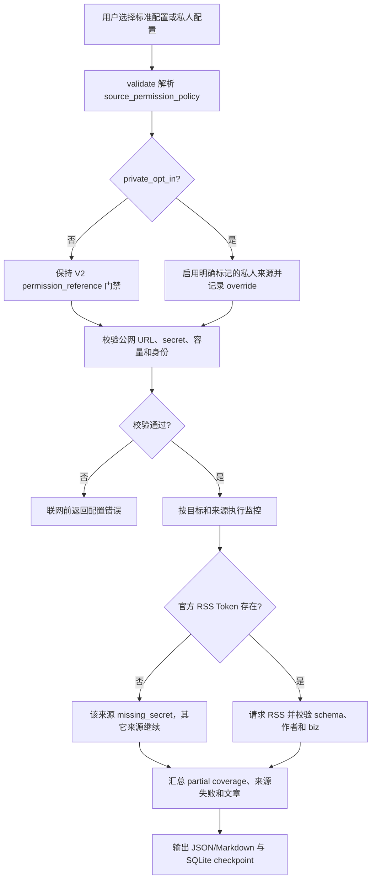

# 需求：pola-wechat-public-account-reader V3 私人宽松模式

artifact: requirement

## 需求口径

- 目标：在保留 V2 批量监控、增量去重和技术安全护栏的前提下，为私人使用提供显式来源宽松模式，
  允许运行缺少 `permission_reference` 的 RSS/第三方来源，并为机器之心提供 sitemap、官方 RSS、
  xInfinite 同时开启的配置。
- 用户：在本机 Codex、Claude Code、Qoder 或 Qoder Work 中维护私人情报监控任务的个人用户。
- 触发：用户明确表示“私人使用”“忽略来源许可检查”“把 RSS/第三方来源都打开”。
- 输入：目标列表 JSON、可选 RSS Token 环境变量、SQLite 状态路径和报告目录。
- 输出：逐来源状态、文章元数据、可验证正文/来源摘要、来源策略和被放开的来源清单。
- 非目标：
  - 不绕过登录、验证码、401/403、付费鉴权或发布方数据服务引导页。
  - 不允许 Cookie、内网/本机 URL、代理轮换、账号池或客户端内部接口。
  - 不移除超时、响应大小、gzip、分页、候选、正文预算、锁、去重和 secret 脱敏。
  - 不自动安装生产 cron、发消息或写入其它外部系统。
- 假设：私人模式由操作者显式选择；官方 RSS 仍可能需要真实 Token，缺失时只是该来源失败。

## 完整用户流程

取消/返回路径：用户移除 `--private-use` 或将配置策略改回 `enforced`，下一次运行恢复 V2 严格行为；
无需迁移 SQLite。

## CLI 与结果布局

- `validate`：显示最终 `source_permission_policy`、有效来源数、私人模式启用来源和许可 override。
- `run`：标准输出增加最终策略；JSON/Markdown 报告的 `selection` 保留策略和 override 清单。
- `cron`：显式 `--private-use` 必须原样进入生成的运行命令；仍只打印、不安装。
- 错误态：
  - 非法策略/布尔值：联网前 `invalid_config`。
  - 官方 RSS 缺 Token：来源 `source_unavailable/missing_secret`，批次继续。
  - CAPTCHA、登录页、数据服务页：正文 `blocked`，不生成伪摘要。
  - 私网、inline Token、Cookie 或跨 origin 鉴权重定向：继续拒绝。

## 功能关系和重复性检查

- 扩展现有 `version=1` 配置、`rss` adapter、target/source `enabled` 和报告 `selection`，不新建第二套
  抓取 runtime。
- 私人模式只自动开启 `enable_in_private_mode=true` 的来源，不重新启用停用 target，也不触碰普通
  运维暂停来源。
- `permission_required` 保留为来源元数据；私人模式只把空引用从 error 降为可追踪 warning。
- `fetch_content_in_private_mode=true` 只改变正文尝试资格，仍受全局/逐目标预算和质量门禁。
- V2 严格资产继续存在；新增私人资产，避免旧定时任务无提示改变行为。

## 验收标准

- A1 文档：新增 V3 Requirement、PRD、SDD、测试矩阵、测试报告和开发日志。
- A2 配置：缺省策略为 `enforced`；非法策略和字符串布尔值在联网前失败。
- A3 私人策略：`private_opt_in` 允许启用缺少 `permission_reference` 的显式来源并产生 warning。
- A4 来源选择：私人模式只启用 `enable_in_private_mode=true` 的来源，不启用停用 target 或普通停用源。
- A5 正文策略：`fetch_content_in_private_mode=true` 生效，但正文数量仍受逐目标和全局预算限制。
- A6 机器之心：私人资产有效开启 sitemap、官方 RSS 和 xInfinite，coverage 仍为 `partial`。
- A7 Token 隔离：缺少 `MACHINEHEART_RSS_TOKEN` 时官方 RSS 为 `missing_secret`，其它来源继续。
- A8 内容真实性：xInfinite 条目仍校验唯一微信链接、作者和 `biz`；数据服务页仍被阻断。
- A9 报告：validate、JSON 和 Markdown 记录最终策略、私人启用来源和 permission override。
- A10 CLI：`validate`、`run`、`cron` 均接受 `--private-use`，cron 参数只出现一次且不自动安装。
- A11 安全回归：SSRF、secret、Cookie、鉴权重定向、容量、超时、锁和摘要真实性门禁全部保持。
- A12 兼容回归：旧配置、Album、Homepage、RSS、sitemap、JSON API、SQLite、四宿主安装器和
  Codex 实机安装态通过；Claude Code/Qoder/Qoder Work 运行态不在本轮验收范围。

## 风险

- 风险等级：P2。私人模式增加外部请求和正文尝试，可能提高 401/403/429、封禁、网络和存储压力。
- 官方 RSS 当前需要 Token；宽松模式不能制造凭据或绕过服务端鉴权。
- 三来源都开启仍不等于公众号完整历史，不能把 `partial` 提升为 `complete`。
- xInfinite 等公网 feed 结构会变化；所有条目被拒时必须报告来源异常而不是“零更新”。
- 第三方 feed 可能给出未来时间戳；机器之心案例使用一小时容差，超出后跳过，不猜测固定时区。

## 任务拆解

- T1（A1–A5）：扩展配置模型、CLI 和选择审计字段。
- T2（A6–A8）：新增机器之心私人资产和来源案例。
- T3（A9–A10）：扩展 JSON/Markdown、validate 和 cron。
- T4（A11–A12）：新增测试并执行全量/公网/安装态回归。
