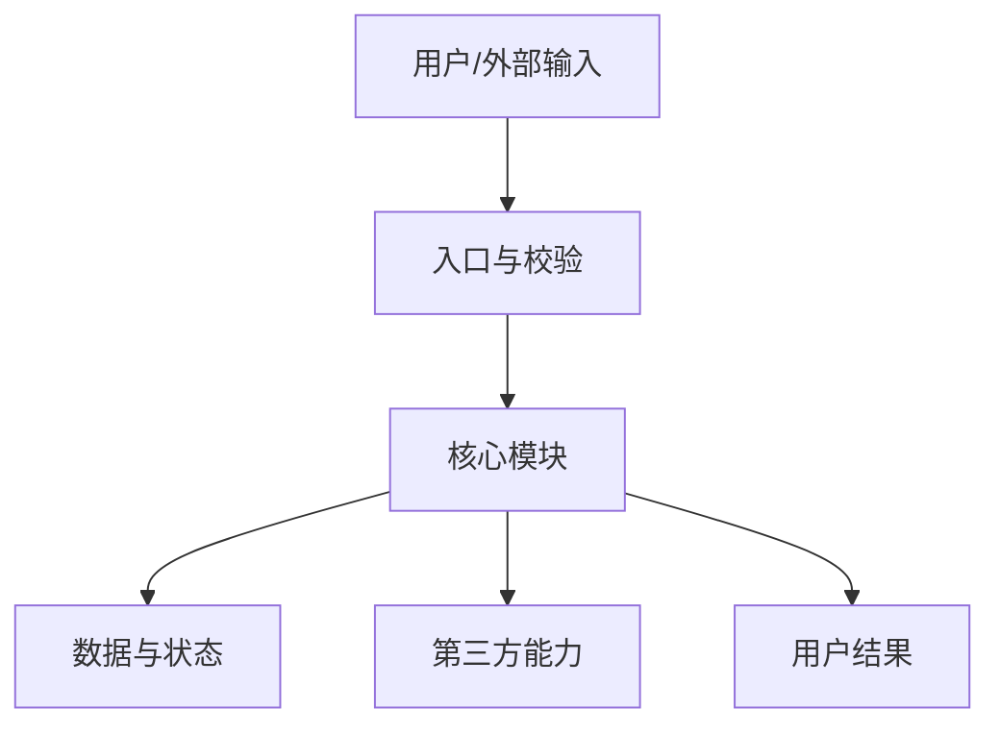

# {{project_name}} 项目研究报告

## 0. 文档信息与证据口径

| 项目 | 内容 |
| --- | --- |
| 研究对象 | `{{owner/repository_or_object}}` |
| 仓库/官网 | {{source_urls}} |
| 固定版本 | {{branch_tag_commit}} |
| 研究日期 | {{date}} |
| 产品形态 | {{product_shape}} |
| 许可证 | {{license_or_unknown}} |
| 报告范围 | {{scope}} |

证据标签：**事实** / **推断** / **建议** / **待确认**。

## 1. 项目概览

### 1.1 一句话定位

> 这是一个面向 {{target_users}}，在 {{trigger_scenarios}} 下，通过 {{core_capability}} 实现 {{user_outcome}} 的项目。

### 1.2 核心信息卡

| 维度 | 内容 |
| --- | --- |
| 目标用户 | {{target_users}} |
| 核心场景 | {{core_scenarios}} |
| 核心价值 | {{core_value}} |
| 技术栈 | {{tech_stack}} |
| 使用/部署方式 | {{usage_or_deployment}} |
| 成熟度 | {{maturity_with_evidence}} |
| 采用判断 | {{trial_cautious_or_no}} |

### 1.3 结论摘要

- 最值得关注：
- 最适合：
- 不适合：
- 最大限制：
- 采用前必须验证：

## 2. 客户、问题与场景

### 2.1 用户原来的麻烦

- 原有流程：
- 具体痛点：
- 项目方案：
- 真正解决：
- 没有解决：

### 2.2 目标角色

| 角色 | 要完成的工作 | 使用方式 | 成功标准 |
| --- | --- | --- | --- |
| {{role_1}} |  |  |  |
| {{role_2}} |  |  |  |

### 2.3 典型场景

每个场景写清角色、触发条件、输入、处理、输出和价值。

## 3. 功能体系

### 3.1 功能全景

### 3.2 核心功能

| 功能 | 用户与触发条件 | 输入 | 处理 | 输出 | 价值 | 异常/边界 | 证据 |
| --- | --- | --- | --- | --- | --- | --- | --- |
|  |  |  |  |  |  |  |  |

### 3.3 完整用户流程

覆盖入口、操作、系统反馈、成功、失败、重试、取消、历史和后续处理。

## 4. 实际场景案例

### 4.1 案例一：{{case_title}}

- 案例类型：官方案例 / 本地验证 / 场景推演
- 背景与用户：
- 前置条件：
- 真实输入：
- 操作步骤：
  1.
  2.
  3.
- 系统内部处理：
- 结果与价值：
- 异常、边界与恢复：
- 验证证据或推演依据：

### 4.2 案例二：{{case_title}}

- 案例类型：官方案例 / 本地验证 / 场景推演
- 背景与用户：
- 前置条件：
- 真实输入：
- 操作步骤：
  1.
  2.
  3.
- 系统内部处理：
- 结果与价值：
- 异常、边界与恢复：
- 验证证据或推演依据：

## 5. 核心技术实现

### 5.1 总体架构

用文字解释组件职责、控制流、数据流和失败路径。

### 5.2 核心执行链

> 用户入口 → 参数/权限校验 → 核心模块 → 数据/第三方 → 状态变化 → 结果/错误

### 5.3 核心模块

| 模块 | 职责 | 输入/输出 | 依赖 | 关键机制 | 风险 | 证据 |
| --- | --- | --- | --- | --- | --- | --- |
|  |  |  |  |  |  |  |

### 5.4 数据、性能与可靠性

- 数据模型与生命周期：
- 存储与清理：
- 并发、超时与重试：
- 幂等、checkpoint 与恢复：
- 日志、监控与脱敏：
- 性能和容量边界：

## 6. 第三方能力与外部依赖

| 依赖 | 用途 | 调用位置 | 传输数据 | 鉴权 | 成本 | 替代/降级 | 失败影响 |
| --- | --- | --- | --- | --- | --- | --- | --- |
|  |  |  |  |  |  |  |  |

## 7. 边界与限制

### 7.1 功能与技术边界

- 明确支持：
- 明确不支持：
- 环境/平台：
- 格式/大小/并发：
- 未验证：

### 7.2 安全、隐私与许可

- 权限模型：
- 敏感数据与外部传输：
- 密钥：
- 许可证和内容权利：
- 已知风险：

### 7.3 成熟度

- 测试和 CI：
- 发布与兼容：
- 维护者和社区：
- 重要未解决项：

## 8. 使用、部署与运维

- 最低运行条件：
- 安装和最小可用路径：
- 配置和密钥：
- 部署方式：
- 日志、监控与备份：
- 升级与回滚：
- 常见故障：

无运行时的项目说明本节为何不适用，以及实际消费方式和宿主要求。

## 9. 项目评价与选型建议

### 9.1 优势、条件与代价

| 优势 | 成立条件 | 对应代价 |
| --- | --- | --- |
|  |  |  |

### 9.2 采用建议

- 推荐采用：
- 建议试点：
- 仅适合研究/教学：
- 当前不建议：

### 9.3 二次开发

- 可直接复用：
- 需要重写：
- 企业使用前补齐：

## 10. 其他注意事项

- 动态数据时效：
- 版权、商标与合规：
- AI 不确定性：
- 网络、地区与硬件：
- 未确认事项：

## 11. 证据与参考

| 结论 | 证据类型 | 文件/链接 | 快照 | 可信度 |
| --- | --- | --- | --- | --- |
|  |  |  |  |  |

## 12. 最终结论

1. 项目本质：
2. 最适合解决：
3. 核心机制：
4. 最大优势：
5. 最大限制：
6. 值得采用的条件：
7. 采用前仍需验证：
